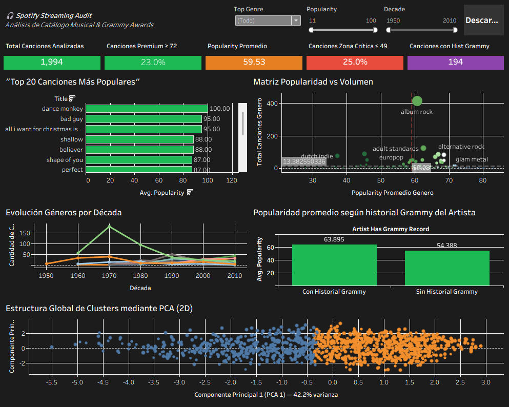

# 🎧 Spotify Streaming Audit — Dashboard & Visualización

Solución desarrollada en el Hackathon Spotify Streaming Audit, utilizando trabajo colaborativo de análisis de datos y ciencia de datos. Utilizando tecnologías como Python, Tableau, DuckDB y algoritmos de aprendizaje automático.

---

## 🎯 Problema de Negocio

Una plataforma de streaming musical cuenta con un catálogo de **1,994 canciones** sin criterio de selección para sus playlists premium. El **25% del catálogo** presenta un Popularity Score menor a 49, lo que puede estar afectando negativamente la experiencia del usuario y la retención.

---

## 🎯 Misión del Proyecto

Identificar qué segmentos del catálogo funcionan y cuáles no, entregando recomendaciones concretas y accionables respaldadas por datos para optimizar la toma de decisiones estratégicas.

---

## 🛠️ Stack Tecnológico

El proyecto está desarrollado utilizando las siguientes herramientas y librerías:

| Herramienta | Uso |
|---|---|
| **Python** | Lenguaje principal |
| **pandas, scikit-learn** | Procesamiento y modelado |
| **Tableau** | Dashboard interactivo y visualización |
| **DuckDB** | Motor SQL para analytics |
| **Jupyter Notebooks** | Entorno de desarrollo |
| **GitHub** | Control de versiones |

---

## 📊 Dashboard Interactivo

🔗 [Ver Dashboard en Tableau Public](https://public.tableau.com/app/profile/isbeth.hernandez/viz/SpotifyStreamingListo/DashboardFinal?publish=yes)



### Visualizaciones incluidas

| Visual | Descripción |
|---|---|
| **KPIs** | Total canciones, canciones premium, popularity promedio, zona crítica, artistas Grammy |
| **Top 20 Canciones Premium** | Las 20 canciones con mayor Popularity Score del catálogo |
| **Matriz Popularidad vs Volumen** | Posicionamiento de géneros por rendimiento y volumen |
| **Evolución de Géneros por Década** | Tendencia histórica de géneros desde 1950 hasta 2010 |
| **Grammy Winners vs No Grammy** | Comparación de popularity entre artistas con y sin Grammy |
| **Clusters Musicales PCA** | Segmentación K-Means con reducción de dimensionalidad PCA |

---

## 📂 Estructura del Proyecto

```
.
├── data/
│   ├── raw/                  # Datasets originales sin modificar
│   ├── processed/            # Datos limpios listos para análisis
│   └── dashboard/            # Archivos CSV exportados para Tableau
├── models/                   # Modelos predictivos entrenados
├── notebooks/                # Notebook principal del análisis
├── presentation/             # Dashboard (.twbx) e imagen del dashboard
└── visualizations/           # Gráficas exportadas
```

---

## 🎯 Contexto del Proyecto

- **Situación:** Catálogo de 1,994 canciones con métricas acústicas sin criterio de selección claro.
- **Complicación:** Datos de prestigio (Grammys) desconectados de los de rendimiento (Spotify).
- **Pregunta:** ¿Cómo integrar y modelar estos datos para predecir la popularidad y segmentar las canciones en playlists premium?
- **Respuesta:** Implementación de un flujo que incluye EDA con Pandas, consultas de segmentación en DuckDB, modelos de Regresión y Clustering (K-Means), presentados en un Dashboard interactivo en Tableau.

---

## 📈 Resultados Clave

- Se identificaron **458 canciones premium** con Popularity Score ≥ 72.
- Se analizaron géneros, décadas y atributos acústicos para definir criterios de priorización.
- Se integró el dataset Grammy Awards como señal complementaria de prestigio musical.
- Los artistas con Grammy tienen **9 puntos más** de Popularity promedio (64 vs 55).
- Se aplicó **K-Means** para segmentar el catálogo en dos perfiles musicales:
  - 🟠 **Canciones Energéticas** — 1,248 canciones (63% del catálogo)
  - 🔵 **Baladas Acústicas** — 746 canciones (37% del catálogo)
- Los dos componentes PCA explican el **66% de la varianza total** del catálogo.

---

## 👥 Equipo y Roles

| Nombre | Rol | Responsabilidades |
|---|---|---|
| 🎨 **Isbeth Hernández** | DA Visualización | Diseño y desarrollo del dashboard en Tableau, integración de datos y modelos, 4 visualizaciones obligatorias y filtro interactivo |
| 🧠 **Isaac Isai Noh Flores** | Data Scientist & Control de Versiones | Gestión del repositorio, modelos predictivos, validación de resultados |
| 📊 **Mónica Ibarra** | DA Business | Análisis Exploratorio de Datos, distribuciones, correlaciones y reporte de negocio |
| 🛠️ **Maria Paz Munita Vidal** | DA Ingeniería & SQL | Calidad de datos, limpieza profunda, consultas DuckDB y buenas prácticas |

---

## 🔗 Repositorio del Equipo

[Ver repositorio completo del proyecto](https://github.com/isaacnhf-oss/Spotify-Streaming-Audit-)

